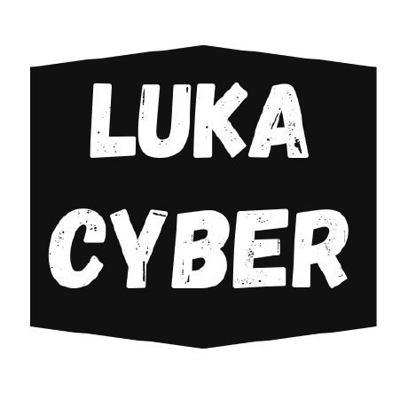

  

# Luka (Luka12-dev)
**Cybersecurity Researcher • AI Developer • Systems Architect**

  
  

---

## Vision
Building the next generation of privacy-first, offline-first tools that place security and user sovereignty at the core. Specializing in red team operations, AI systems, low-level programming, and high-performance software that operates independently of the cloud.

Mission: Democratize cybersecurity knowledge and create powerful, transparent tools for ethical hackers, privacy advocates, and developers who prioritize freedom and security.

## Core Principles
- Privacy by Design – Data remains local and fully offline-capable  
- Open Source First – Transparency builds lasting trust  
- Performance Obsessed – Native speed with minimal overhead  
- Security Focused – Designed against real-world threat models  

---

## Tech Arsenal

### Languages

### Frameworks & Tools

---

## Featured Projects

### [LuxxerOS](https://github.com/Luka12-dev/LuxxerOS)
**Virtual Operating System** • Python / PyQt6  
Lightweight virtual OS simulator featuring over 100 integrated tools spanning cybersecurity, productivity, development utilities, and a fully customizable macOS-inspired GUI with virtual filesystem and window management.

### [ChatBOT](https://github.com/Luka12-dev/ChatBOT)
**Offline AI Assistant** • Flutter / llama.cpp  
Android application that runs large language models completely offline. Supports model switching, local conversation history, multi-language chats, and privacy-preserving inference with zero cloud dependency.

### [AI-VISTA](https://github.com/Luka12-dev/AI-VISTA)
**AI Image Generation Studio** • PyQt / Stable Diffusion  
Professional desktop-first AI art platform powered by Stable Diffusion and SDXL. Includes responsive web UI for LAN/mobile access, real-time image streaming, model management, LoRA support, and advanced prompt engineering.

### [K3Y](https://github.com/Luka12-dev/K3Y)
**Ethical Hash Auditor** • C++17  
High-performance, multi-threaded framework for password security research and hash testing (MD5, SHA256). Provides detailed benchmarks and educational insights into cryptographic strength.

### [Cyon](https://github.com/Luka12-dev/Cyon)
**Systems Programming Language** • Compiler Development  
Statically-typed systems language with Python-like syntax that compiles to native code via C. Features memory safety, reference counting, dynamic arrays, and cross-platform support.

### [RedScript](https://github.com/Luka12-dev/RedScript)
**Rapid GUI Engine** • PyQt6  
Fast GUI prototyping tool for security utilities and automation scripts. Enables creation of dynamic, interactive interfaces with real-time components and custom callbacks.

### [SystemOptimizerPro](https://github.com/Luka12-dev/SystemOptimizerPro)
**System Performance Monitor** • JavaFX  
Intelligent real-time system optimizer with automatic RAM/CPU management, smart cache cleaning, and comprehensive performance analytics.

### [Xengine](https://github.com/Luka12-dev/Xengine)
**Game Engine** • C# / .NET 8.0  
Modular, cross-platform game engine for 2D and 3D development. Includes component-based architecture, scene management, rendering, physics simulation, audio, input handling, UI framework, and networking.

### [RO-DOS](https://github.com/Luka12-dev/RO-DOS)
**Operating System** • x86 Assembly / C  
32-bit protected mode hobby OS with custom bootloader, FAT12 filesystem, memory management, hardware abstraction, and over 100 DOS-style commands. Educational project bootable on real hardware and QEMU.

### [AquaDev](https://github.com/Luka12-dev/AquaDev)
**Local AI Development Agent** • Python / Ollama  
Fully private, offline AI coding assistant powered by Ollama. Supports file operations, real-time response streaming, granular permissions, and a clean terminal interface with no data leaving the machine.

---

  
  

---

## Connect

  
  
  

---

  <strong>Build tools that free minds. Write code that respects privacy. Hack ethically, dream limitlessly.</strong> 
  Pushing boundaries in cybersecurity, one commit at a time.

  Open to collaborations • Privacy advocate • Ethical hacker in training

